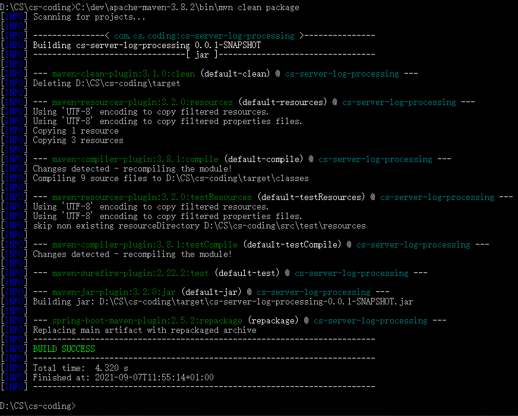
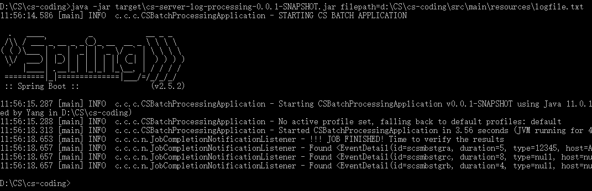
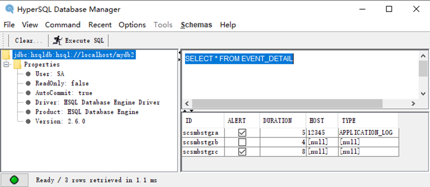

# CS Coding Assignemnt Java

### Environment:

- Java 8 ( code compile level )
  
- Maven 3.8

- Intellij Community IDE

- HyperSQL 2.6.0 ( running with JDK11 )

### Assumptions / Constraints:

1. Json object available in a single line, not crossing multiple lines
   
2. ID is String value, not in UUID

3. Not enough unit tests provided due to time restriction, I tried to finish all within 2 hrs.

## Key Points / Thoughts:

I think the best way to handle this kind of requests is to use Spring Batch.

The path to logfile.txt can be passed in as a job parameter from command line.

The most chaallenging part of this problem is to handle very large files (gigabytes).

I am using FlatFileItemReader for this simple implementation, but different ways I can think of are:
1 better chunk size
2 streaming;
3 use database as a map, which will be very slow though.

I am using a map to temporarily store the server log item with the id as the key. This might be a bottleneck as well.
If there is any matching with the id then it will be removed from map, and the item will be added into database.
The restriction of this way is the map might be not big enough if the file is huge, this depends on the JVM setting, but it's possible to cause memory leak due to unmatched items and failed to run if there is no memory left.
I did not get a chance to do extreme test though.

### Build:

Update datasource URL based on your environment:
spring.datasource.url=jdbc:hsqldb:hsql://localhost/mydb2

$ mvn clean package

### Execution:

$ java -jar target\cs-server-log-processing-0.0.1-SNAPSHOT.jar filepath=<Location_of_log_file>

ie.
$ java -jar target\cs-server-log-processing-0.0.1-SNAPSHOT.jar filepath=d:\CS\cs-coding\src\main\resources\logfile.txt

### Log

Log will be available on console and also will be appended to cs-app-log.txt in the project root directory

### Screenshots:

Build from command line:

Execution from command line:

Database result after execution:

